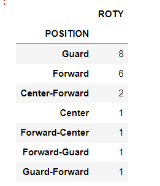
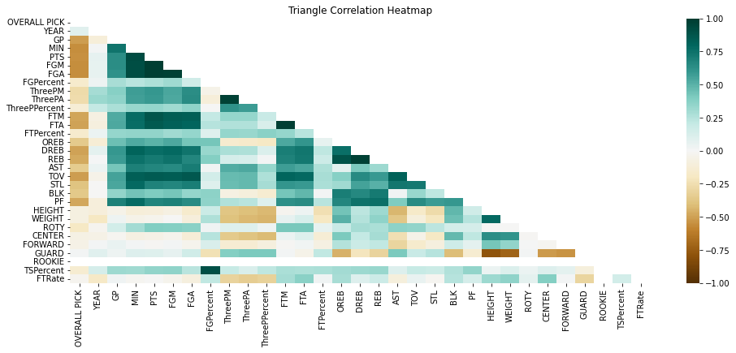
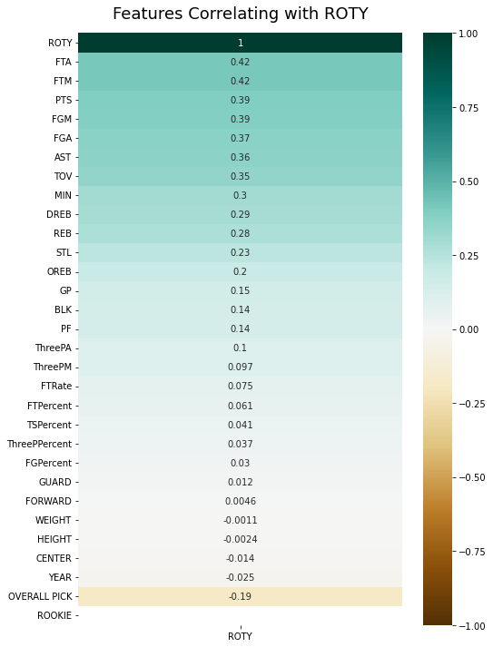

# NBA Rookie of the Year Predictor: Project Overview
* Created a tool that predicts which rookie will win NBA Rookie of the Year
* Scraped data of over 1000 players from the last 21 NBA drafts using python and selenium
* Engineered features of advanced NBA statistics
* Tested 6 models including XGBoost, RandomForest, and SelectKBest and optimized the best model using GridSearchCV and Precision Recall Curve
* Built a client facing API using Flask

## Code Requirements
**Python Version:** 3.7
**Packages:** pandas, numpy, sklearn, matplotlib, seaborn, selenium, flask, json, pickle
**For Web Framework Requirements:** <pre><code>pip install -r requirements.txt</code></pre>

## Data Resources
* https://www.nba.com/stats/draft/history/
* https://www.basketball-reference.com/awards/roy.html

## Web Scraper
Scraped data such as:
* PLAYER	
* AFFILIATION	
* OVERALL PICK	
* YEAR	
* TEAM	
* GP	
* MIN	
* PTS	
* FGM	
* FGA	
* FGPercent
* ThreePM	
* ThreePA	
* ThreePPercent	
* FTM	
* FTA	
* FTPercent	
* OREB	
* DREB	
* REB	
* AST	
* TOV	
* STL	
* BLK	
* PF	
* HEIGHT	
* WEIGHT	
* POSITION	
* ROTY	
* CENTER	
* FORWARD	
* GUARD	
* ROOKIE

## Data Cleaning
After scraping data the new rookies didn't have some of the same advanced stats that the NBA players did so I needed to merge the intersection of columns. In addition I removed players with NaN stats and tidied the data. I also made indicator variables for player positon (guard, forward, center).

## Data EDA
I looked at data distributions and correlations between variables the ROTY statistic. I then removed features with VIF scores higher than 5. Here are some highlights from my exploration.

## Model Building
I split the data into training and test sets with test sizes of 20%. I had two different training sets and two different test sets correlating to the data set with and without advanced stats. I had three different models: XGBoost, RandomForest, and SelectKBest using chi2. I evaluated the models using sklearn's accuracy_score. The best model was the SelectKBest model in conjunction with the advanced stat dataset. All the models would deal with the irregularity of the data using L2 penalties.

## Model Performance
* SelecKBest without advanced stats:  0.9787234042553191
* XGBoost without advanced stats:  0.9716312056737588
* RandomForest without advanced stats:  0.9716312056737588
* SelectKBest with advanced stats:  0.9858156028368794
* XGBoost with advanced stats:  0.9716312056737588
* RandomForest with advanced stats:  0.975177304964539

## Productionization
In this step, I built a flask API endpoint that was hosted on a local webserver. The API endpoint takes in a request with a list of values for a players stats, transforms the data to fit the model and predicts the probability of them winning NBA Rookie of the Year.
